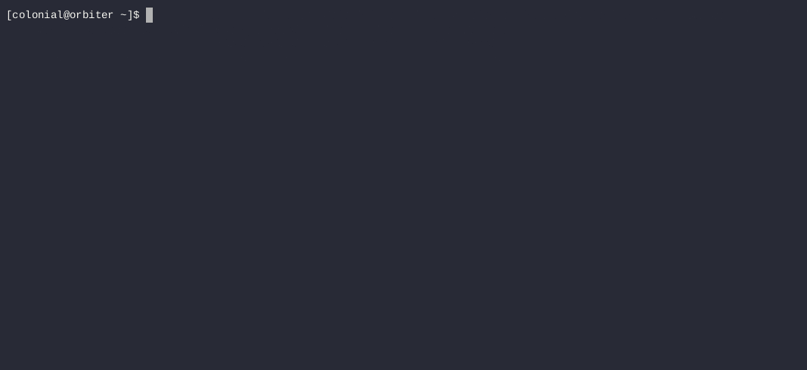

<h1 align="center">Fishtank</h1>
<h3 align="center">An interactive container manager for the <code>fish</code> shell.</h3>

<p align="center">


</p>

## Features
Easily create and manage container environments for interactive use. All host integration is strictly opt-in; you choose what (if anything) is shared with each container.

<p align="center">
    
</p>

Bring your existing Docker-style container definitions...

<p align="center">
    
</p>

... or take advantage of Fishtank's custom shell-based format that bundles together all the information needed to build *and* run your containers.

<p align="center">
    
</p>

Lightweight[^1], easy to install, and works on any[^2] Linux machine with `podman` and `fish`.

<p align="center">
    
</p>

## Installation
Before installing, make sure you have the following packages on your system:
- `fish`
- `podman`
- `coreutils`

```sh
curl -Lf https://github.com/Colonial-Dev/fishtank/releases/latest/download/tankctl | source - install
```

This downloads the latest stable version of Fishtank and uses the self-update functionality to bootstrap a persistent install.

By default, this installs two scripts (`tankctl` and `tankcfg`) in the XDG-specified `$HOME/.local/bin` directory - to override the install location, simply pass your preferred path as the third argument:

```sh
curl -Lf https://github.com/Colonial-Dev/fishtank/releases/latest/download/tankctl | source - install /usr/bin
```

### From Source
If you are allergic to `curl | exec`, "building" Fishtank from source using the bundled `do` script is also possible.

```sh
git clone https://github.com/Colonial-Dev/fishtank && cd fishtank
./do install
```

## Getting Started

Fishtank requires a definition ("tank") for each container you'd like to create. Definitions can be in two different formats:
- Standard Container/Dockerfiles - just add `# fishtank containerfile` to the text and you're good to go.
- `fish` shell scripts that run in a special harness. This injects additional functions and wraps a few others to provide additional functionality not present in Containerfiles, like the ability to declare runtime arguments such as mounts.

Either type must be stored under `$XDG_CONFIG_HOME/fishtank/` (typically `~/.config/fishtank/`) with the file extension `.tank`.

To create and edit a new definition, you can simply run `tankctl create <NAME>`. This will create the file and open it using your `$EDITOR`.

`tankctl edit <NAME>` can be used to alter existing definitions; both commands will use a temporary file for editing and perform syntax checks before finalizing any changes.

Shell-based definitions run in the same directory as the definition, and should look something like this:

```sh
# Create a new working container.
set ctr (buildah from fedora-toolbox:latest)

# Set up the new container...
RUN dnf install gcc

# Commit the configured container as an image.
buildah commit $ctr toolbox
```

The harness for shell-based definitions enables two primary toolkits for setting up your container.
- All Containerfile directives like `RUN` and `ADD` are polyfilled as Fish functions, and generally act the same as their real counterparts. 
  - (The most notable exception is pipes and redirections in `RUN` - you must wrap them in an `sh -c` to execute them wholly inside the working container.)
- The `tankcfg` script, which lets you:
  - Set various build-time (some of which are duplicated from the above) and runtime switches
  - Provide arbitrary additional arguments to pass to `podman run`
  - Apply several prepackaged presets (such as copying a user from the host into the container, or applying security options to fix bind mounts with SELinux)

Once you have a definition, run `tankctl build` to compile it into an OCI image, followed by `tankctl up` to create a container from the image.

Complete details on all commands can be found in the `man` pages bundled with Fishtank. Alternatively, you can view their Markdown versions [here](https://github.com/Colonial-Dev/fishtank/tree/master/doc).

___

For those who would like a concrete example, this is a (annotated and trimmed down) copy of the definition I use
for my development containers.

```sh
#!/usr/bin/env fish
# A shebang is not necessary, but it enables correct syntax highlighting in my editor.

# If this is the 'base' definition, bail silently - we don't need to build that.
#
# Fishtank tries to be relatively stateless, so it doesn't bother detecting that no image
# was actually built and comitted.
if [ (status basename | xargs basename -s .tank) = "base" ]
    exit
end

# Fedora Toolbox is my preferred base, but there are similar images
# available for distributions like Debian and Arch.
#
# The 'buildah' command here is actually a transparent wrapper injected by Fishtank;
# when you invoke the 'from' subcommand, it does some book-keeping to integrate
# the working container with Fishtank.
set ctr (buildah from fedora-toolbox:latest)

# Copy my user into the container.
#
# You may notice that these commands don't take a 'container' argument;
# that's because the aforementioned 'buildah' wrapper exports that information
# into a fixed shell variable for these commands to use internally.
tankcfg preset cp-user $USER
# Fix Unix and SELinux permission issues with rootless mounting of host files.
tankcfg preset bind-fix
# Mount the SSH agent socket into the container. (Implies bind-fix)
tankcfg preset ssh-agent

# Set the working user to myself...
USER    $USER
# ... and the working directory to my $HOME inside the container.
WORKDIR /home/$USER
# A dummy 'infinite command' like this keeps the container alive so processes on the host
# can spawn 'exec' sessions inside.
CMD     "sleep inf"

# Copy my GNU Stow .dotfiles directory into the container.
ADD --chown $USER:$USER -- $HOME/.dotfiles /home/$USER/.dotfiles

# Install some basics (preferred shell and editor, GNU Stow.)
RUN sudo dnf install -y fish micro stow
# Stow my basic dotfiles, as well as some container specific ones.
RUN stow -d /home/$USER/.dotfiles --dotfiles common
RUN stow -d /home/$USER/.dotfiles --dotfiles container

# This 'EXTENSIONS' variable is used in a small script, unrelated to this project,
# that automatically installs extensions into the Visual Studio Code development container server.
set -a EXTENSIONS Gruntfuggly.todo-tree
set -a EXTENSIONS mhutchie.git-graph

# A switch statement is used to branch on the symlink this definition was invoked from,
# allowing multiple different definitions to build on a common base (above.)
#
# I have more than just these two, but two is sufficient to get the point across.
switch (status basename | xargs basename -s .tank)
# A C development environment for a course on networks that I am currently taking.
case "p438"
    set -a EXTENSIONS llvm-vs-code-extensions.vscode-clangd
    set -a EXTENSIONS vadimcn.vscode-lldb
    
    ENV "EXTENSIONS=$EXTENSIONS" 
    
    RUN sudo dnf groupinstall -y "C Development Tools and Libraries"
    RUN sudo dnf install      -y clang clang-tools-extra
    RUN sudo dnf install      -y pip
    RUN pip install --user scons

    # Mount my coursework repository into the container $HOME, and nothing else.
    tankcfg mount type=bind,src=$HOME/Documents/CS,dst=/home/$USER/CS
# A Rust development environment for my personal projects.
case "rust"
    set -a EXTENSIONS vadimcn.vscode-lldb
    set -a EXTENSIONS tamasfe.even-better-toml
    set -a EXTENSIONS rust-lang.rust-analyzer
    
    ENV "EXTENSIONS=$EXTENSIONS" 
    ENV "CARGO_INSTALL_ROOT=/home/$USER/.local"
    
    RUN sh -c "curl --proto '=https' --tlsv1.2 -sSf https://sh.rustup.rs | sh -s -- -y"

    # Rust needs a C/++ toolchain for building foreign dependencies.
    RUN sudo dnf groupinstall -y "Development Tools"
    RUN sudo dnf groupinstall -y "C Development Tools and Libraries"
    RUN mkdir -p /home/$USER/.local/bin
    
    # Mount my projects directory, as well as the host user binary directory.
    #
    # Combined with setting CARGO_INSTALL_ROOT, this means I can 'cargo install' binaries
    # inside the container and use them outside it.
    tankcfg mount type=bind,src=$HOME/Documents/Projects,dst=/home/$USER/Projects
    tankcfg mount type=bind,src=$HOME/.local/bin/,dst=/home/$USER/.local/bin/
# Nominally unreachable.
case "*"
    exit 1
end

# Commit the container, basing the name on the symlink used to invoke this definition.
buildah commit $ctr localhost/(status basename | xargs basename -s .tank)
```

The file layout for this particular definition looks similar to this:

```sh
# Using symbolic links for "branching builds" like this is one of my pet tricks, but it's not required!
base.tank # Singular authoritative definition
p438.tank # Symbolic link to base.tank
rust.tank # Symbolic link to base.tank
```

While Fishtank may be branded as an "interactive" container manager, it works just as well for containerized services. This definition is all I need for my Jellyfin server, including support for AMD hardware acceleration:

```sh
#!/usr/bin/env fish

set ctr (buildah from jellyfin/jellyfin:latest)

tankcfg preset bind-fix

tankcfg device /dev/dri/renderD128 
tankcfg mount type=bind,src=$HOME/Executable/Jellyfin/config,dst=/config
tankcfg mount type=bind,src=$HOME/Executable/Jellyfin/cache,dst=/cache
tankcfg mount type=bind,src=$HOME/Videos/DLNA,dst=/media,ro=true

tankcfg args "--net=host" 
tankcfg args "--group-add=105" 
tankcfg args "--user=1000:1000"

buildah commit $ctr jellyfin
```


## FAQ

### "Why `fish` instead of POSIX `sh`?"
Well, I *could* have written Fishtank in POSIX `sh` - in the same sense that I *could* stick a fork into my eye repeatedly.

More seriously - I started this as an excuse to learn some scripting after migrating from `bash` to `fish`, and it matured into something I thought others might find useful.

If you prefer a different shell, you can still use Fishtank! The scripts are self-contained and properly shebanged, so simply installing `fish` and placing them somewhere in your `$PATH` should work fine.

### "How does this compare to Toolbx or Distrobox?"
It depends!

I used to heavily rely on Toolbx for my development environments, and I also dabbled with Distrobox. Both are excellent tools, but I have one big gripe with both: host integration.

- Toolbx automatically runs as `--privileged` with (among other things) your entire `$HOME` and `$XDG_RUNTIME_DIR` mounted into the container, and offers no way to opt-out.
- Distrobox is similar, but does offer some opt-outs. You can also choose to use an alternate `$HOME` on the host (not inside the container.)

Fishtank, by contrast, is entirely opt-in when it comes to host integrations. You get to choose precisely what (if anything) is shared.

Fishtank also requires that every container be associated with a "definition," rather than defaulting to a standard "toolbox" image for each container. These can either be standard Containerfiles, or they can use Fishtank's custom shell-based format to declare runtime arguments (like mounts)[^3] during build time.

So:
- If you don't mind the above caveats and want containerized environments that Just Work with the host, use Toolbx or Distrobox.
- If you *do* mind the above caveats and/or want some declarative-ness in your containers, give Fishtank a try.


### "Why not just use Kubernetes YAML or `compose`?"
A few reasons:

1. Separating the information on how to *build* the image from information on how to *run* it is lame, especially for Fishtank's target use case of "bespoke interactive containers."
2. Kubernetes YAML is massively overcomplicated, and the `podman` version of `compose` was somewhat buggy when I tried it.
3. YAML sucks.

[^1]: Only ~1000 lines of pure Fish shell code.

[^2]: Fishtank was developed on a system that uses GNU Coreutils and GNU `libc` - if you find that Fishtank doesn't work with alternative implementations, please file an issue!

[^3]: If you are wondering how this works: Fishtank bakes the arguments you provide at build time into the image using OCI annotations, then reads them out and applies them when creating a container from the image.