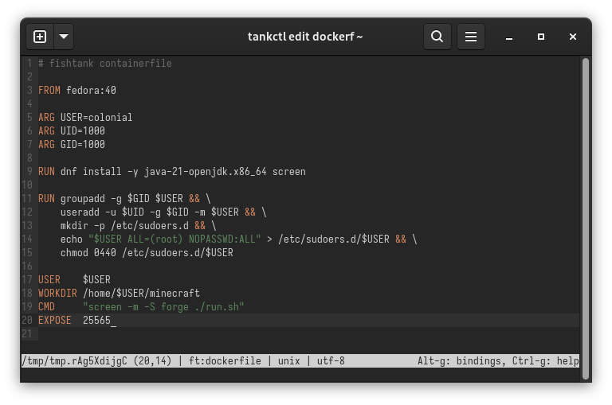
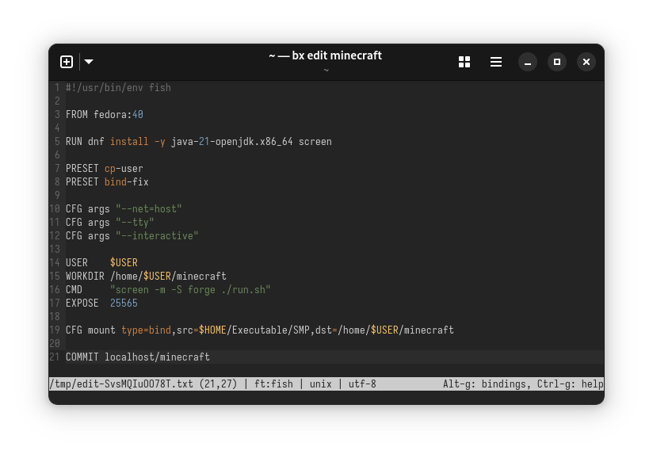

<h1 align="center">Box</h1>
<h3 align="center">A script-based interactive container manager.</h3>

<p align="center">


</p>

## Features
Easily create and manage container environments for interactive use. All host integration is strictly opt-in; you choose what (if anything) is shared with each container.

<p align="center">
    
</p>

Bring your existing Docker-style container definitions...

<p align="center">
    
</p>

... or take advantage of Box's custom shell-based format that bundles together all the information needed to build *and* run your containers.

<p align="center">
    
</p>

Lightweight[^1], easy to install, and works on any Linux machine with `podman` and a compatible shell (POSIX-compliant or `fish`.)

## Installation
Before installing, make sure you have `podman` and a supported shell (either `fish` or anything POSIX-compliant) installed on your system.

### From Source (Recommended)
Build-time dependencies:
- The most recent stable [Rust toolchain](https://rustup.rs/).
- A C/C++ toolchain (such as `gcc`.)

The rest is easy - just use `cargo install`, and Box will be automatically compiled and added to your `PATH`.
```sh
cargo install --locked --git https://github.com/Colonial-Dev/box --branch master
```

The same command can be used to update Box in the future.

### MUSL Binary
Alternatively, statically-linked MUSL binaries are available in the [releases](https://github.com/Colonial-Dev/box) section. 

## Getting Started

Box requires a definition for each container you'd like to create. Definitions can be in two different formats:
- Standard Container/Dockerfiles - just add `#~ containerfile = true` to the text and you're good to go.
- Shell scripts (POSIX or `fish`) that run in a special harness. This injects additional functions and wraps a few others to provide additional functionality not present in Containerfiles, like the ability to declare runtime arguments such as mounts.

Either type must be stored with the file extension `.box` under either:

- `$BOX_DEFINITION_DIR`
- `$XDG_CONFIG_HOME/box`
- `$HOME/.config/box`

... in that order.

To create and edit a new definition, you can simply run `box create <NAME>`. This will create the file and open it using your `$EDITOR`.

`box edit <NAME>` can be used to alter existing definitions; both commands will use a temporary file for editing.

Shell-based definitions run in the same directory as the definition, and should look something like the below. I use Fish, but the general structure
readily translates to POSIX-compatible syntaxes.

```sh
# Create a new working container.
set ctr (FROM fedora-toolbox:latest)

# Set up the new container...
RUN dnf install gcc

# Commit the configured container as an image.
COMMIT $ctr toolbox
```

The harness for shell-based definitions provides several tools for setting up your container.
- All Containerfile directives like `RUN` and `ADD` are polyfilled as shell functions, and generally act the same as their real counterparts. 
  - (The most notable exception is pipes and redirections in `RUN` - you must wrap them in an `sh -c` to execute them wholly inside the working container.)
- The `CFG` and `PRESET` directives, which let you:
  - Set various build-time and runtime switches
  - Provide arbitrary additional arguments to pass to `podman run`
  - Apply several prepackaged presets (such as copying a user from the host into the container, or applying security options to fix bind mounts with SELinux)

Once you have a definition, run `bx build` to compile it into an OCI image, followed by `bx up` to create a container from the image.

You can find exhaustive documentation and examples on shell-based definitions [here](https://github.com/Colonial-Dev/box/blob/master/DEFINITIONS.md).

___

For those who would like a concrete example, this is a (annotated and trimmed down) copy of the definitions I use
for my development containers.

```sh
#!/usr/bin/env fish
# A shebang is required for Box to disambiguate between Fish and POSIX.

# Fedora Toolbox is my preferred base, but there are similar images
# available for distributions like Debian and Arch.
set ctr (FROM fedora-toolbox:latest)

# Copy my user into the container.
PRESET preset cp-user $USER
# Fix Unix and SELinux permission issues with rootless mounting of host files.
PRESET preset bind-fix
# Mount the SSH agent socket into the container. (Implies bind-fix)
PRESET preset ssh-agent

# Copy my GNU Stow .dotfiles directory into the container.
ADD --chown $USER:$USER -- $HOME/.dotfiles /home/$USER/.dotfiles

# Install some basics (preferred shell and editor, GNU Stow.)
RUN sudo dnf install -y fish micro stow
# Stow my basic dotfiles, as well as some container specific ones.
RUN stow -d /home/$USER/.dotfiles --dotfiles common
RUN stow -d /home/$USER/.dotfiles --dotfiles container

# Set the working user to myself...
USER    $USER
# ... and the working directory to my $HOME inside the container.
WORKDIR /home/$USER
# A dummy 'infinite command' like this keeps the container alive so processes on the host
# can spawn 'exec' sessions inside.
CMD     "sleep inf"

# Commit the image.
COMMIT $ctr localhost/base
```

```sh
#!/usr/bin/env fish
#~ depends_on = ["base"]
# Box is capable of computing (and following) 
# a dependency graph for your definitions via the `depends_on` metadata key.

set ctr (FROM localhost/base)

ENV "CARGO_INSTALL_ROOT=/home/$USER/.cargo/install"

RUN sh -c "curl --proto '=https' --tlsv1.2 -sSf https://sh.rustup.rs | sh -s -- -y"

# Rust needs a C/++ toolchain for building foreign dependencies.
RUN sudo dnf groupinstall -y "Development Tools"
RUN sudo dnf groupinstall -y "C Development Tools and Libraries"
RUN mkdir -p /home/$USER/.local/bin

# Mount my projects directory, as well as a host user binary directory.
#
# Combined with setting CARGO_INSTALL_ROOT, this means I can 'cargo install' binaries
# inside the container and use them outside it.
tankcfg mount type=bind,src=$HOME/Documents/Projects,dst=/home/$USER/Projects
tankcfg mount type=bind,src=$HOME/.local/bin/cargo,dst=/home/$USER/.cargo/install/bin

# Commit the container, basing the name on the symlink used to invoke this definition.
COMMIT $ctr localhost/rust
```

While Box may be branded as an "interactive" container manager, it works just as well for containerized services. This definition is all I need for my Jellyfin server, including support for AMD hardware acceleration:

```sh
#!/usr/bin/env fish

set ctr (FROM jellyfin/jellyfin:latest)

PRESET bind-fix

CFG device /dev/dri/renderD128 
CFG mount type=bind,src=$HOME/Executable/Jellyfin/config,dst=/config
CFG mount type=bind,src=$HOME/Executable/Jellyfin/cache,dst=/cache
CFG mount type=bind,src=$HOME/Videos/DLNA,dst=/media,ro=true

CFG args "--net=host" 
CFG args "--group-add=105" 
CFG args "--user=1000:1000"

COMMIT $ctr jellyfin
```

In testing, I've had success with everything from a Minecraft server to [Ollama](https://ollama.com) by simply adapting existing Docker instructions.

## FAQ

### "How does this compare to Toolbx or Distrobox?"
It depends!

I used to heavily rely on Toolbx for my development environments, and I also dabbled with Distrobox. Both are excellent tools, but I have one big gripe with both: host integration.

- Toolbx automatically runs as `--privileged` with (among other things) your entire `$HOME` and `$XDG_RUNTIME_DIR` mounted into the container, and offers no way to opt-out.
- Distrobox is similar, but does offer some opt-outs. You can also choose to use an alternate `$HOME` on the host (not inside the container.)

Box, by contrast, is entirely opt-in when it comes to host integrations. You get to choose precisely what (if anything) is shared.

> This is good for "soft" security against stuff like supply chain attacks; if (some day) I execute a `build.rs` that tries to hijack my session tokens or wipe my system - no big deal.

Box also requires that every container be associated with a "definition," rather than defaulting to a standard "toolbox" image for each container. These can either be standard Containerfiles, or they can use Box's custom shell-based format to declare runtime arguments (like mounts) during build time.

> I find this particularly advantageous for ensuring a consistent environment between my desktop and my laptop. It also makes for a good "lazy man's NixOS" on my Pi-hole server.

So:
- If you don't mind the above caveats and want containerized environments that Just Work with the host, use Toolbx or Distrobox.
- If you *do* mind the above caveats and/or want some declarative-ness in your containers, give Box a try.

### "Why not just use Kubernetes YAML or `compose`?"
A few reasons:

1.  For Box's target use case of "bespoke interactive containers," separating the information on how to *build* the image from information on how to *run* it is lame.
    - I am also an avowed [locality of behavior](https://htmx.org/essays/locality-of-behaviour/) enjoyer.
2. Kubernetes YAML is massively overcomplicated for what I wanted to do, and the `podman` version of `compose` was somewhat buggy when I tried it.
3. YAML is... YAML.

### "Creating containers (`up`) is extremely slow."

This seems to be a `podman` issue with the default `overlay` storage driver on BTRFS (and possibly ZFS) systems that causes expensive copies during container creation.
I followed [this](https://www.jwillikers.com/podman-with-btrfs-and-zfs) guide to switch my storage driver to use BTRFS subvolumes and experienced massive speedups.

### "Why Rust?"
It's my favorite out of the "good for command-line" language pantheon.

The main requirements were:
- Quick, especially at startup.
- Space efficient.
- No runtime dependencies apart from the `podman` suite.

A fast, small, and self-contained binary is one that I can commit to my `dotfiles` repository and forget about. The same cannot be said of an equivalently feature rich Python utility.

[^1]: Single Rust binary compiled from ~2000 lines of boring plumbing code. Red Hat and the OCI have already done all the heavy lifting here!
